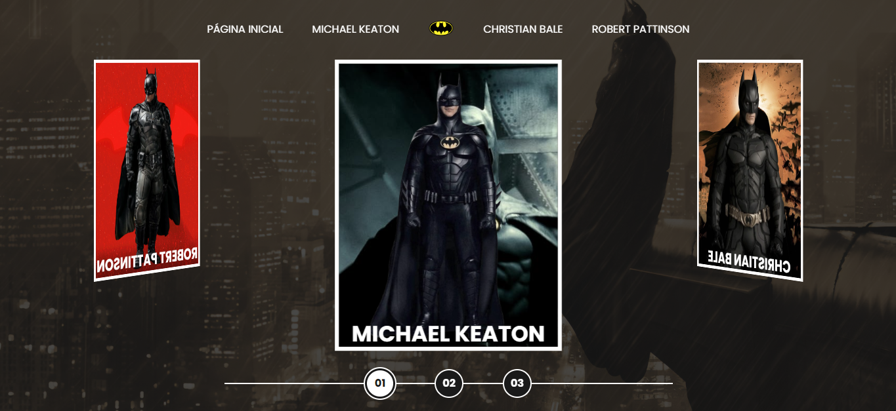

# 🦇 Batverse

Projeto interativo do multiverso Batman, com páginas temáticas, trilhas sonoras, trailers e galeria de imagens dos principais Batmans do cinema.

  
  
  
  
  
  

## 🎬 Batmans presentes
- Adam West
- Michael Keaton
- Christian Bale
- Robert Pattinson

## ✨ Funcionalidades
- Carrossel 3D na home com tema Batman
- Páginas individuais para cada Batman
- Trailer em vídeo e trilha sonora de cada filme
- Galeria de imagens com Fancybox (lightbox)
- Layout responsivo (mobile e desktop)
- Navegação temática e botões estilizados

> Observação: o arquivo `.nojekyll` é necessário no GitHub Pages para servir diretórios que começam com `_` (como `_gallery.css`, `_navigator.css`).

## 📝 Autor
Desenvolvido por **Henrique Bandeira**  

